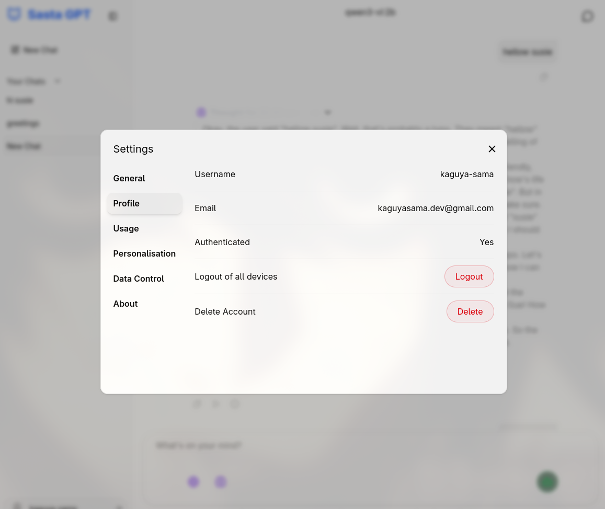
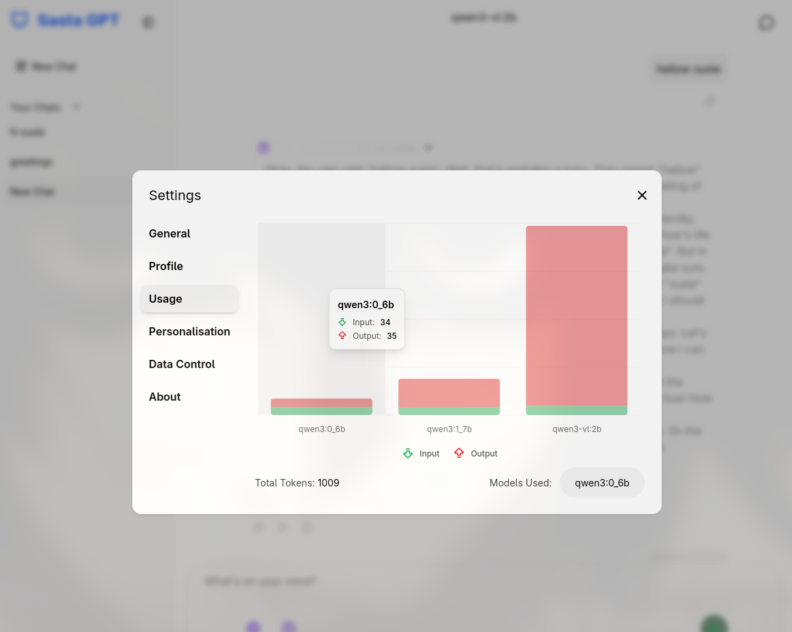
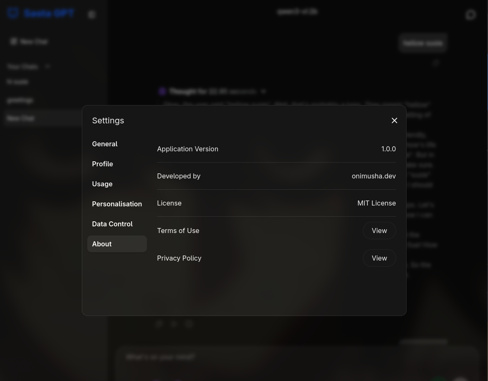

# Chai-Chan — A Web Ollama Client

Chai-Chan is a web-based client for running local AI models through Ollama. I built it after getting tired of the lack of good Linux-friendly interfaces and the fact that most existing tools didn’t support multi-user setups or proper chat history. This project aims to fix that by giving teams and individual users a clean, fast, browser-based way to work with local models.

    
    

## What It Does
- Web UI for sending messages to local Ollama models
- Multi-user system with JWT auth and isolated chat histories
- Session management with autosave to MongoDB
- Model switching, custom system prompts, and optional Gemini API support
- Usage analytics (token counts, model stats)
- Works locally or on a shared network so multiple users can share one Ollama instance

### In-App Screenshots

    
    
    
    
    
    
    

 

## Tech Stack
**Frontend:** React + TypeScript, Vite, Tailwind, shadcn/ui, React Router, Recharts  
**Backend:** Node.js (Express 5), TypeScript, MongoDB/Mongoose, Zod validation, JWT auth, Bcrypt  
Everything is written with a focus on clean structure, type safety, and predictable behavior.

## Architecture
The client talks to an Express server that handles auth, sessions, model requests, and analytics. The server connects to MongoDB for storing chats and user data, and forwards model prompts to the local Ollama instance (or Gemini if configured). The whole thing is designed to be simple to deploy on any machine (mac, windows, linux).

## Why I Built It
I wanted a real project that would push my full-stack skills beyond tutorials. Over the past ~10 months I learned how to build production-style systems: API design, authentication, component design, error handling, logging, and general project structure. Chai-Chan has been my way of turning that learning into something usable.

## Setup
- Node.js 18+, pnpm, MongoDB, Ollama
- `pnpm install` in both client and server folders
- `pnpm dev` to run each side
- Ollama must be running (`ollama serve`)

Environment variables:  
`MONGODB_URI`, `OLLAMA_URL`, `GOOGLE_API_KEY` (optional), `JWT_SECRET`, `PORT`

## Future Plans
WebSocket support for live streaming, plugin system, improve existing codebase, better collaboration features, Docker images, and multi-language support.

**Repo:** https://github.com/onimusha-dev/Chai-Chan  
